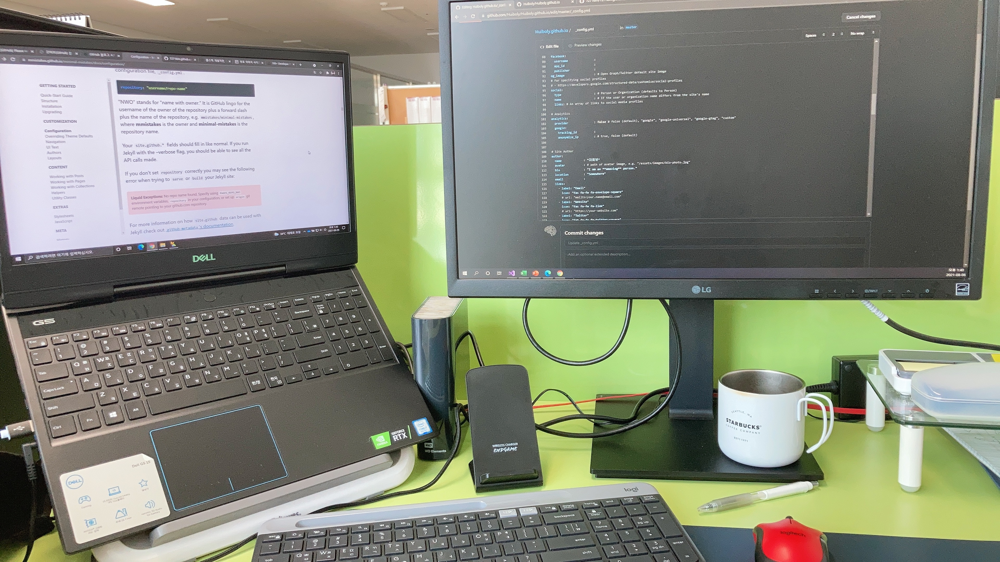

### 개발 공간

여기는 **특별한 공간**이다. 아직 개발되지 않은 타임머신이 존재하는 곳이기 때문이다. 물론 시간을 거슬러 되돌릴 수 없지만 미래로 향하여 빠르게 다가갈 수 있다.

**특별한 공간**에서 한잔의 아메리카노는 나에게 최상의 컨디션을 제공한다. ~~혹시 카페인 중독일까?~~ 커피를 음미하다 보니 깊은 생각에 잠긴다. '개발자로서 나는 어떤 사람인가?', '지금 내 수준을 알고 있는가?' 나에 대한 질문에 쉽게 답을 못하는 나는 누구인가? 점차 나에 대한 정체성이 희미해져 간다. 나를 담는 공간이 필요하다.

또 다른 **특별한 공간**에 기록함으로 나에 대하여 명확히 알기를 원하며 블로그를 시작 한다.
