---
개인 블로그를 운영하기 위한 첫걸음으로 블로그의 종류에 대하여 알아보니 네이버 블로그, 티스토리, Velog 등 여러 플랫폼이 존재했다.
블로그에 대한 지식과 경험이 없는 상태에서 무엇을 선택할지 고민하다가 자연스럽게 개발자스러운(*배움의 길이 무궁무진한*) 플랫폼인 GitHub Pages를 선택했다.

## GitHub Pages



GitHub Pages가 무엇인지 이해하기 앞서 GitHub란 무엇인지 궁금하여 검색을 통해 알아보았다.
GitHub는 버전 관리와 협업을 위한 코드 호스팅 플랫폼이다.
버전 관리는 버전 관리 시스템(*Version Control System 이하 VCS*)에서 파일에 변화를 시간에 따라 기록하고 특정 버전의 파일을 가져올 수 있는 기능이다.
VCS로 관리되는 형상(*소스 코드, 문서, 이미지 등*)을 클라우드 저장소에 담고 있어 사용자간에 협업이 용이할 수 있게 제공된다.

GitHub Pages는 GitHub의 기능 중 하나로 클라우드 저장소에 내용을 웹호스팅 서비스로 제공된다.
즉 **자신이 개발한 웹페이지를 복잡한 웹서버를 구축하지 않고 서비스** 할 수 있도록 도와주는 도구이다.

## GitHub Pages 시작하기

#### 1. GitHub 계정 생성하기

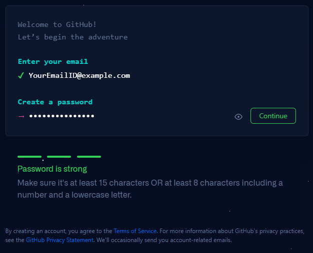

GitHub Pages는 GitHub 계정당 하나의 사이트가 제공된다.
계정이 없는 경우 계정당 하나의 이메일 인증으로 계정을 생성할 수 있다.
비밀번호는 숫자와 소문자를 포함한 8 ~ 15자 이내로 만들어야 한다.

#### 2. 저장소 만들기

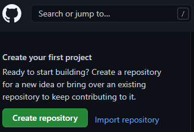

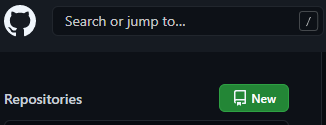

로그인 후 메인화면 좌측 상단에 `Create repository` 또는 `New` 버튼을 클릭한다.

이미 원하는 Jekyll 테마의 URL 정보를 취득한 경우 `Import repository` 버튼을 클릭 하고 [여기](#4-개인-저장소에-테마-저장소-복사하기)를 눌러 다음 단계를 건너띈다.

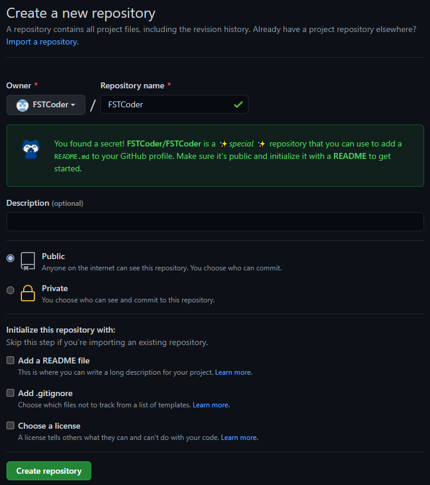

Owner와 Repository name을 입력하고 `Create repository` 버튼을 눌러 저장소를 생성 한다.
Owner와 Repository name 값을 동일하게 입력할 때 위와 같이 시크릿 메시지가 출력 되며 `README.md`에 내용이 자동으로 GitHub 메인 사이트와 연동된다.

#### 3. Jekyll Theme 활용하기

Jekyll은 GitHub Pages에 대한 지원이 내장된 정적 웹사이트 생성기이다.
GitHub 저장소 내 `Markdown`, `HTML` 등 파일을 정해진 규약으로 가져와 선택한 레이아웃을 기반으로 정적 웹사이트를 생성하는 도구이다.
GitHub Pages에서 공식으로 지원하며 다양한 테마가 제공된다.

Jekyll에 대한 추가 내용은 [여기](../about-jekyll)에서 확인할 수 있다.

* [GitHub.com #jekyll-theme repos](https://github.com/topics/jekyll-theme){:target="_blank"}
* [jamstackthemes.dev](https://jamstackthemes.dev/ssg/jekyll/){:target="_blank"}
* [jekyllthemes.org](http://jekyllthemes.org/){:target="_blank"}
* [jekyllthemes.io](https://jekyllthemes.io/){:target="_blank"}
* [jekyll-themes.com](https://jekyll-themes.com/){:target="_blank"}

위 링크는 Jekyll 테마 웹사이트를 제공하는 사이트 목록이다.
링크에서 원하는 Jekyll 테마를 선택한다.

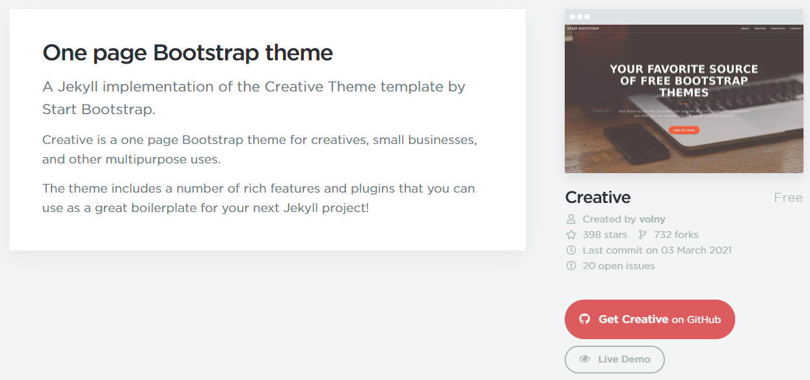

테마를 선택했다면 테마의 GitHub 사이트에 접속한다.

스크린샷의 테마를 사용하려면 [여기](https://jekyllthemes.io/theme/creative-theme-jekyll){:target="_blank"}를 클릭한다.

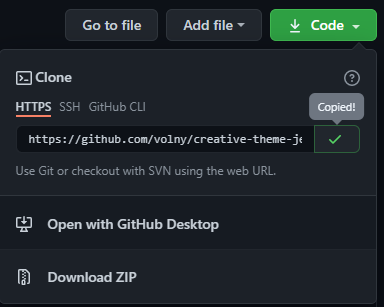

테마의 GitHub 메인 화면에서 `Code` 버튼을 클릭하여 URL 정보를 복사한다.

#### 4. 개인 저장소에 테마 저장소 복사하기

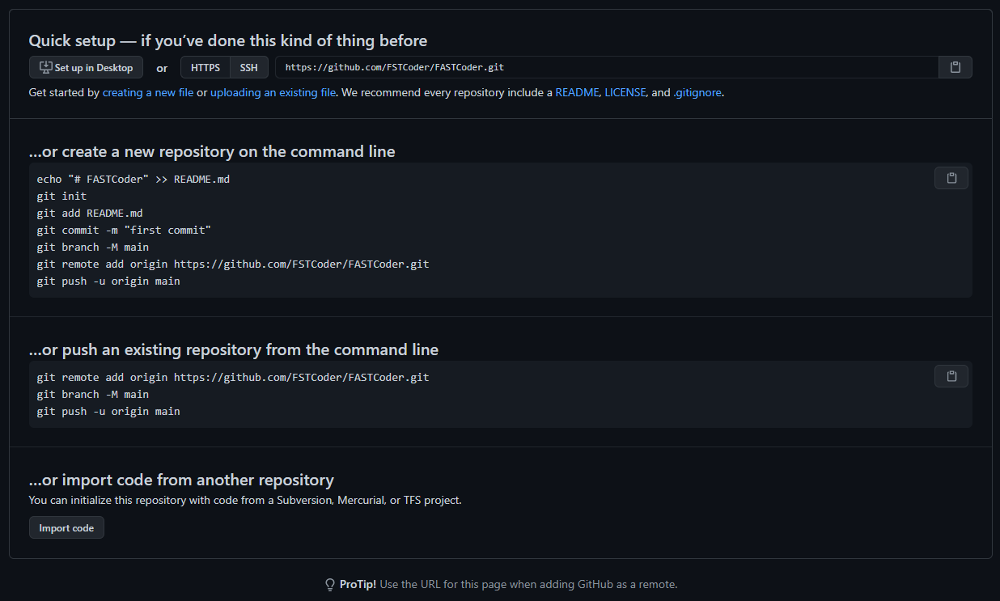

저장소 만들기 단계에서 생성한 저장소 메인 화면에서 `Import code` 버튼을 클릭한다.

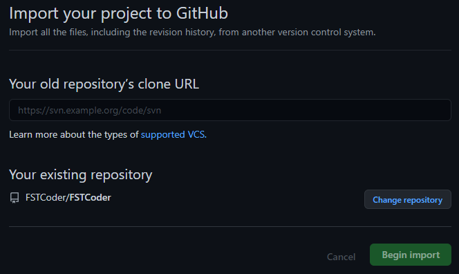

URL 정보 입력란에 복사한 URL 정보를 입력하고 `Begin import` 버튼을 클릭한다.

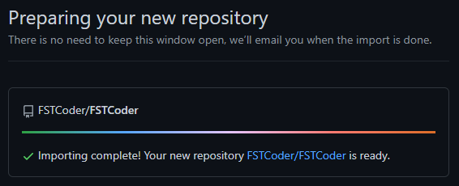

Jekyll 테마 저장소에 있는 데이터를 개인 저장소에 복사(*Clone*)할 때 작업 소요 시간은 테마 용량에 따라 다르다.
~~커피 한잔을 음미하며 차분히 기다린다.~~

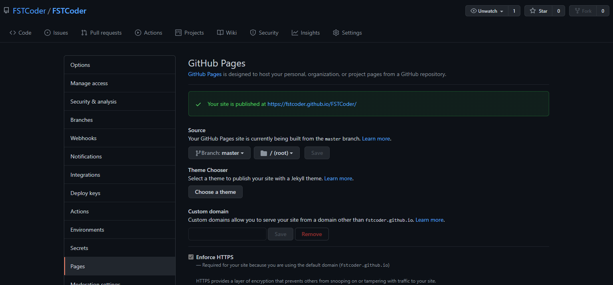

복사 작업이 완료되면 개인 저장소 메인 화면 -> 설정(*Settings*) 메뉴 -> 페이지 서브 메뉴에서 소스(*Source*) 영역에 `Branch: master`와 같이 설정 후 저장한다.
위 웹페이지 주소를 통해 접속할 수 있으니 즐겨찾기나 `README.md`에 링크를 추가하여 매번 사이트 주소를 찾는 번거로움을 줄일 수 있다.

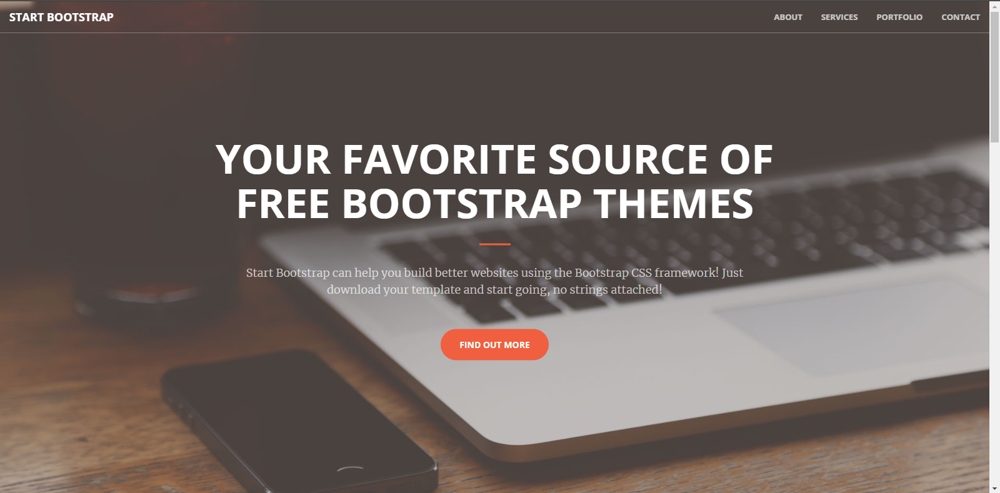

위와 같이 웹페이지에 테마가 적용 되었다면 GitHub 블로그 만들기에 첫 걸음을 내딛는 것이다.

다른 테마를 선택하여 위 절차를 진행하는데 테마가 제대로 적용이 안되는 경우, 해당 테마의 GitHub 사이트에 별도로 설정해야 하는 절차가 있는지 확인하여 추가 절차를 진행해야 한다.<!--more-->
