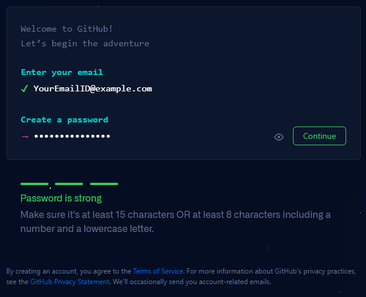
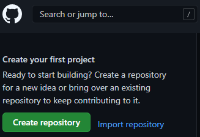
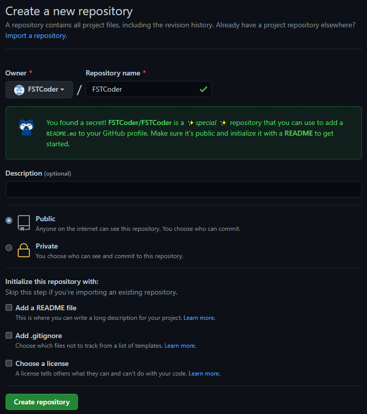
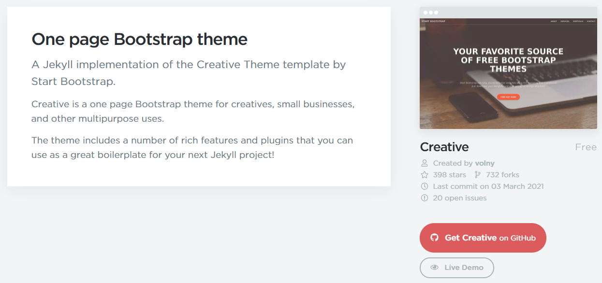
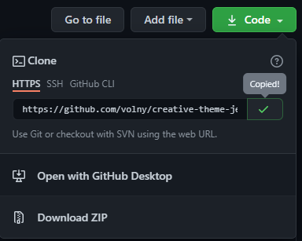
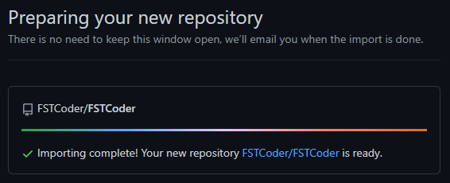
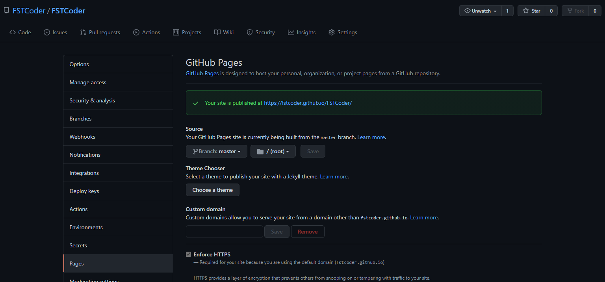

개인 블로그를 운영하기 위한 첫걸음으로 블로그의 종류에 대하여 알아보니 네이버 블로그, 티스토리, Velog 등 여러 플랫폼이 존재했다. 블로그에 대한 지식과 경험이 없는 상태에서 무엇을 선택할지 고민하다가 자연스럽게 개발자스러운 *(배움의 길이 넓은)* 플랫폼인 GitHub Pages를 선택 했다.

### GitHub Pages란?



GitHub Pages가 무엇인지 이해하기에 앞서 GitHub가 무엇인지 알아야 했다. GitHub는 버전 관리와 협업을 위한 코드 호스팅 플랫폼이다. 버전 관리는 버전 관리 시스템 *(Version Control System 이하 VCS)* 에서 파일 변화를 시간에 따라 기록하고 특정 버전의 파일을 가져올 수 있는 기능이다. VCS로 관리되는 형상 *(소스 코드, 문서, 이미지 등)* 을 클라우드 저장소에 기록하여 다른 사용자와 협업이 용이할 수 있도록 서비스 한다. GitHub Pages는 GitHub의 기능으로 클라우드 저장소에 내용을 웹호스팅 서비스로 제공 한다.
즉 ***자신이 개발한 웹페이지를 복잡한 웹서버 구축없이 서비스 할 수 있도록 도와주는 도구*** 이다.

### GitHub Pages 시작하기

##### 1. GitHub 계정 생성하기

GitHub Pages는 GitHub 계정당 하나의 사이트가 제공된다. 혹시 계정이 없다면 이메일 인증으로 계정을 생성할 수 있다. 비밀번호는 숫자와 소문자를 포함한 8 ~ 15자 이내로 만들어야 한다.

##### 2. 저장소 만들기

로그인 후 메인화면 좌측 상단에 `Create repository` 또는 `New` 버튼을 클릭한다. 미리 선택한 Jekyll 테마에 URL을 알고 있는 경우 `Import repository` 버튼을 클릭하고 [4단계](#4-개인-저장소에-테마-저장소-복사하기)로 건너뛴다.

Owner와 Repository name을 입력하고 `Create repository` 버튼을 눌러 저장소를 생성한다. Owner와 Repository name을 동일하게 입력할 경우 위와 같이 히든 메시지가 출력되며 `README.md`에 내용을 사이트에서 확인할 수 있다.

##### 3. Jekyll 테마 활용하기

Jekyll은 GitHub Pages에 대한 지원이 내장된 정적 웹사이트 생성기이다. 쉽게 말해 `Markdown`, `HTML` 파일을 가져와 선택한 레이아웃을 기반으로 정적 웹사이트를 생성하는 도구이다. GitHub Pages에서 공식으로 지원하며 다양한 테마가 있다.

* [GitHub.com #jekyll-theme repos](https://github.com/topics/jekyll-theme){:target="_blank"}
* [jamstackthemes.dev](https://jamstackthemes.dev/ssg/jekyll/){:target="_blank"}
* [jekyllthemes.org](http://jekyllthemes.org/){:target="_blank"}
* [jekyllthemes.io](https://jekyllthemes.io/){:target="_blank"}
* [jekyll-themes.com](https://jekyll-themes.com/){:target="_blank"}

Jekyll 공식 홈페이지에서 제공하는 테마 웹사이트 목록이다. 링크에서 원하는 테마를 선택한다.

테마를 선택했다면 테마의 GitHub 사이트에 접속한다. 스크린샷의 테마를 사용하려면 [여기](https://jekyllthemes.io/theme/creative-theme-jekyll){:target="_blank"}를 클릭한다.

GitHub 메인화면에서 `Code` 버튼을 클릭하여 URL을 복사 한다.

##### 4. 개인 저장소에 테마 저장소 복사하기

저장소 만들기 단계에서 생성한 저장소 메인 화면에서 `Import code` 버튼을 클릭한다.

URL 입력하는 영역에 복사한 URL을 입력하고 `Begin import` 버튼을 클릭한다.

복사가 진행될 때 소요 시간은 인터넷 환경, 테마 용량에 따라 정해진다. ~~차분히 기다리며 커피 한잔을 음미한다.~~

복사가 완료되면 저장소 메인 화면 -> Settings 메뉴 -> Pages 서브 메뉴에서 Source 영역에 `Branch: master`와 같이 설정한다. 그리고 위에 링크를 통해 접속할 수 있으니 즐겨찾기에 웹사이트를 저장하여 매번 사이트 주소를 찾는 번거로움을 줄인다.

위와 같이 웹페이지에 테마가 적용 되었다면 GitHub 블로그 만들기에 성공한것이다. 다른 테마를 선택하여 진행하는데 테마가 제대로 적용이 안되는 경우, 해당 테마의 GitHub에서 추가로 설정하는 부분이 있는지 확인하여 추가 절차를 진행해야 한다.

Jekyll에 대한 추가 내용은 [여기](../jekyll)에서 확인할 수 있다.
