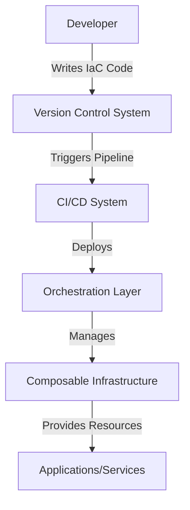

현대의 IT 인프라스트럭처는 점점 더 복잡해지고 있으며, 다양한 워크로드와 요구사항을 충족하기 위해 유연성과 확장성을 갖춘 설계가 필수적이다. 이와 같은 요구를 충족하기 위해 등장한 개념이 바로 **Composable Infrastructure**이다. 이를 Infrastructure-as-Code(IaC)와 결합하면, 인프라를 코드로 정의하고 자동화된 방식으로 조율할 수 있는 강력한 환경을 구축할 수 있다. 이 문서에서는 Composable Infrastructure와 IaC를 활용한 오케스트레이션의 개념, 기술적 원리, 구현 방법, 그리고 실무 적용 시의 장단점과 고려사항을 다룬다.

<!--more-->

## 시스템 아키텍처 및 데이터 흐름

Composable Infrastructure는 하드웨어 자원을 소프트웨어 정의 방식으로 구성 및 관리하는 접근법이다. 이를 통해 컴퓨팅, 스토리지, 네트워크 자원을 필요에 따라 동적으로 할당할 수 있다. 아래는 Composable Infrastructure와 IaC를 결합한 오케스트레이션의 일반적인 아키텍처를 나타낸 다이어그램이다.



- **Developer**: IaC 코드를 작성하여 인프라를 정의함.
- **Version Control System**: IaC 코드의 버전 관리 및 협업 지원.
- **CI/CD System**: IaC 코드를 기반으로 자동화된 배포 파이프라인 실행.
- **Orchestration Layer**: Composable Infrastructure를 제어하고 자원을 동적으로 할당.
- **Composable Infrastructure**: 소프트웨어 정의 방식으로 구성 가능한 하드웨어 자원.
- **Applications/Services**: 제공된 자원을 활용하여 실행되는 워크로드.

## 기술 개요 및 핵심 원리

### Composable Infrastructure의 핵심 원리
1. **소프트웨어 정의**: 하드웨어 자원을 소프트웨어로 추상화하여 관리 가능.
2. **유연한 자원 할당**: 필요에 따라 컴퓨팅, 스토리지, 네트워크 자원을 동적으로 재구성.
3. **자동화**: API 또는 IaC 도구를 통해 자원 할당 및 해제를 자동화.

### Infrastructure-as-Code의 역할
1. **코드 기반 정의**: 인프라를 코드로 정의하여 반복 가능하고 일관된 배포 가능.
2. **버전 관리**: 코드 변경 사항을 추적하고 롤백 가능.
3. **자동화된 배포**: CI/CD 파이프라인과 통합하여 인프라 배포를 자동화.

## 실무에서 검증된 코드 구현체와 사용 가이드

아래는 Terraform을 사용하여 Composable Infrastructure를 정의하고 배포하는 예제 코드이다.

### Terraform 코드 예제
```hcl
provider "aws" {
  region = "us-west-2"
}

resource "aws_instance" "web" {
  ami           = "ami-0c55b159cbfafe1f0"
  instance_type = "t2.micro"

  tags = {
    Name = "WebServer"
  }
}

resource "aws_ebs_volume" "storage" {
  availability_zone = "us-west-2a"
  size              = 10
  tags = {
    Name = "StorageVolume"
  }
}

resource "aws_volume_attachment" "ebs_attach" {
  device_name = "/dev/xvdf"
  volume_id   = aws_ebs_volume.storage.id
  instance_id = aws_instance.web.id
}
```

### 사용 가이드
1. Terraform 설치 및 초기화:
   ```bash
   terraform init
   ```
2. 코드 작성 후 계획 확인:
   ```bash
   terraform plan
   ```
3. 인프라 배포:
   ```bash
   terraform apply
   ```
4. 배포된 인프라 확인:
   AWS Management Console에서 생성된 EC2 인스턴스와 EBS 볼륨 확인.

## 적용 시 장단점 및 고려사항

### 장점
1. **유연성**: 필요에 따라 자원을 동적으로 구성 가능.
2. **효율성**: 자원 활용도를 극대화하여 비용 절감.
3. **자동화**: 반복적인 작업을 자동화하여 운영 효율성 향상.
4. **일관성**: IaC를 통해 동일한 환경을 재현 가능.

### 단점
1. **초기 학습 곡선**: Composable Infrastructure와 IaC 도구에 대한 학습 필요.
2. **복잡성 증가**: 대규모 환경에서의 관리 복잡성.
3. **디버깅 어려움**: 자동화된 프로세스에서 발생하는 문제의 원인 파악이 어려울 수 있음.

### 고려사항
1. **보안**: API 및 IaC 코드의 보안 설정 강화 필요.
2. **테스트 환경**: 프로덕션 환경에 적용하기 전에 테스트 환경에서 충분히 검증.
3. **모니터링 도구**: 자원 사용량 및 성능 모니터링을 위한 도구 통합 필요.

Composable Infrastructure와 IaC를 결합한 오케스트레이션은 현대 IT 환경에서 필수적인 기술로 자리 잡고 있다. 이를 효과적으로 활용하면 유연하고 자동화된 인프라를 구축할 수 있지만, 초기 학습과 설계 단계에서의 신중한 접근이 요구된다.